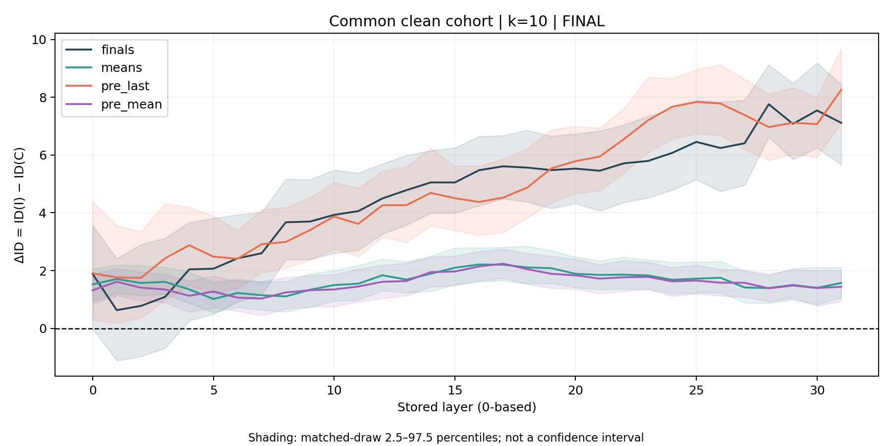
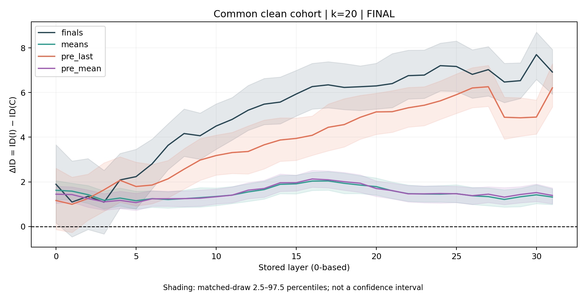

# Aligned representation comparison

This analysis compares four representations on the same filtered
cohort: `finals`, `means`, `pre_last`, and `pre_mean`.

**Delta ID = ID(incorrect) − ID(correct)**

Positive values indicate higher estimated intrinsic dimension
for incorrect responses.

## Experimental setup

- 129 problems
- 2,541 attempts in the common filtered cohort
- 397 selected attempts per class in each matched draw
- 120 matched draws
- Neighborhood sizes: k=10 and k=20
- L2 normalization
- Leave-one-problem-out sensitivity analysis

## Results at k=10

## Results at k=20

Shading represents matched-draw sampling percentiles,
not confidence intervals.

## Late-layer summary

Mean Delta ID across layers L24–L31 and 120 matched draws:

| Representation | k=10 | k=20 |
|---|---:|---:|
| `finals` | 6.834 | 6.981 |
| `means` | 1.556 | 1.365 |
| `pre_last` | 7.510 | 5.610 |
| `pre_mean` | 1.519 | 1.429 |

All eight late-layer estimates remain positive under every
leave-one-problem-out omission.

## Supporting tables

- [Late-layer estimates and sensitivity ranges](closure_late_id.csv)
- [Paired prefix-versus-full contrasts](closure_paired_late.csv)

## Interpretation

Positive Delta ID persists in prefix representations on this
common filtered cohort.

The ordering of `pre_last` and `finals` depends on k.
The findings describe associations and do not establish
causal mechanisms.

Sampling percentiles and LOPO ranges are not confidence intervals.

[Return to the project overview](../../README.md)
