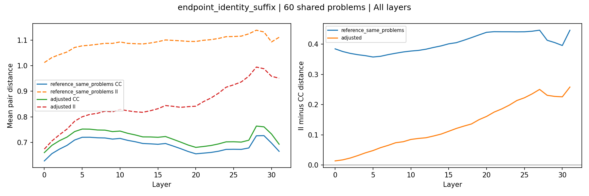
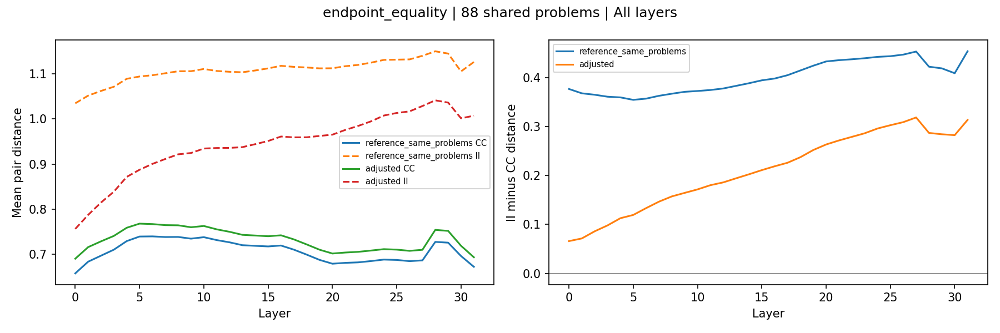
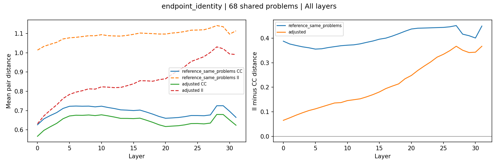

# Endpoint and suffix controls

**Notebook 20 · Phi-2 · GSM8K · FINAL run**

Correct–correct pairs remain closer than incorrect–incorrect pairs after balancing endpoint identities and measured suffix overlap within problems. On the strongest control's retained 60-problem cohort, the mean L24–L31 distance gap decreases from **0.4286 to 0.2328**. This is a descriptive geometric association, not a causal explanation.

## Research question

[Notebook 19](../prefix_text_similarity/README.md) found that correct attempts at the same problem have closer `pre_last` representations and more similar prefix endings. Does the distance contrast remain when correct and incorrect pairs are compared under similar endpoint and suffix conditions?

The prediction stated before running this follow-up was a smaller positive distance gap after control, relative to a reference on the same retained problems. The analysis is exploratory: earlier findings on this cohort motivated its design.

## What is measured?

`pre_last` is the hidden-state vector immediately before the token overlapping the selected numeric answer span. Each pair contains two attempts of the same correctness class at the same problem.

Distances are Euclidean distances between row-L2-normalized vectors. The reported contrast is:

**Distance gap = mean incorrect–incorrect distance − mean correct–correct distance.**

A positive gap means correct pairs are closer on average. This is not Delta ID or classification accuracy. Smaller pair distances do not automatically imply lower intrinsic dimension.

## Procedure

The analysis reuses Notebook 19's exact saved pair distances: 1,056 correct–correct (CC) and 10,084 incorrect–incorrect (II) pairs across 88 problems. It makes no new generations, extracts no new representations, and changes no individual pair distances.

Three controls balance text conditions within each problem:

| Control | Matched conditions | Retained problems |
|---|---|---:|
| Endpoint equality | Whether the two endpoint tokens match each other | 88 |
| Endpoint identity | Actual unordered pair of endpoint token IDs | 68 |
| Endpoint identity and suffix (primary) | Endpoint identities, consecutive matching trailing-token count up to eight, and compared window length | 60 |

The primary control exactly matches the measured suffix-overlap score. It does **not** require identical complete suffix wording across CC and II pairs. Text features exclude the shared prompt; the hidden-state vectors still represent its contextual influence.

### How the weighting works

Within each problem and text-condition group, let the overlap mass be the smaller of the CC and II pair counts. Spread that mass equally across the group's CC pairs and separately across its II pairs. Normalize the weights within each problem/class, then average equally across retained problems.

For example, a group with 2 CC and 6 II pairs receives mass 2: each CC pair initially gets weight 1 and each II pair weight 1/3. Both classes therefore give the same total weight to that group. Groups present in only one class receive zero weight. Problems without shared groups are not retained for that control.

Weights depend on text conditions and class membership, not vector distances. Exact joint balance is checked. Each adjusted result is compared with an unadjusted reference using **all original pairs from those same retained problems**.

[Retention summary](tables/retention_summary.csv) · [Per-problem retention](tables/retention_by_problem.csv)

## Primary result: endpoint identity and suffix control

The strongest control gives positive weight to **257 CC pairs and 573 II pairs across 60 problems**. Unequal pair counts are compatible with exact balance because pairs are weighted.

Mean distances across the fixed L24–L31 summary window:

| Measurement | Reference: same 60 problems | After control |
|---|---:|---:|
| Correct–correct pair distance | 0.6890 | 0.7207 |
| Incorrect–incorrect pair distance | 1.1176 | 0.9535 |
| **II minus CC distance gap** | **0.4286** | **0.2328** |

The mean gap is approximately **45.7% smaller** under the control. This is a descriptive relative reduction, not a causal percentage explained. Correct pairs remain closer in **51 of 60 problems** using their late-layer average. The gap decreases under control in **48 of 60 problems**, so the aggregate reduction is not universal.

Reweighting slightly increases the CC average and decreases the II average more substantially. The vectors do not move: the contributions of existing pairs to the averages change.

[Distance summaries](tables/distance_summary.csv) · [Per-problem distances](tables/distance_by_problem.csv) · [Paired changes](tables/paired_adjustment_summary.csv)

## Full layer pattern

The adjusted mean gap is positive at every analyzed layer. It is small at L00 (0.0137) and generally grows through the network, reaching 0.2579 at L31, with late-layer fluctuations. All layers use the same pairs and weights. This pattern does not identify what contextual information accounts for the remaining difference.

## Other controls

Each row compares the adjusted result with its own retained-problem reference. Because the controls retain different populations, their differences are not incremental causal effects.

| Control | Problems | Reference gap, L24–L31 | Adjusted gap, L24–L31 |
|---|---:|---:|---:|
| Endpoint equality | 88 | 0.4363 | 0.2992 |
| Endpoint identity | 68 | 0.4326 | 0.3468 |
| Endpoint identity and suffix | 60 | 0.4286 | 0.2328 |

## Checks and remaining imbalance

- Exact source prefix token hashes, generated-prefix boundaries, and endpoint/suffix features are validated against the preceding analysis.
- Matching weights and text conditions are unchanged between QUICK and FINAL.
- All 64 source-distance reproduction checks pass: two classes at each of 32 layers.
- Joint distributions of the controlled text conditions are balanced within retained problems.
- Global wording overlap, prefix length, and earlier selected-value mentions remain different between classes.

[Source reproduction checks](tables/source_reproduction_checks.csv) · [Feature balance](tables/feature_balance.csv)

## Interpretation and limitations

Balancing measured endpoint and suffix conditions reduces but does not eliminate the late-layer distance contrast on retained support. A residual contrast does not demonstrate shared reasoning or a causal correctness mechanism.

- The strongest result concerns 60 retained problems, not all 88 original pair-analysis problems or the full dataset.
- Some problems contribute few positively weighted pairs. Effective pair counts describe weight concentration, not independent sample sizes.
- Pairs share attempts. No independent-pair confidence intervals or significance tests are reported.
- The cohort inherits duplicate filtering, answer-span selection, and stored-precision limitations. Prefixes can contain earlier answer mentions or intermediate numbers.
- The controls do not balance all text, numerical content, or reasoning structure.
- This follow-up was motivated by results on the same cohort and has not been independently replicated on another model or dataset.
- These results do not quantify how much of the earlier intrinsic-dimension gap is explained by text features.

## Reproducibility

These are the **FINAL Notebook 20** results: all 32 layers and the fixed L24–L31 summary. QUICK used only L00, L24, and L31.

Notebook 20 reuses the original FINAL Notebook 19 per-layer distance checkpoints and reconstructs endpoint features from frozen metadata using the tokenizer. It does not require new model inference. The original Notebook 19 run directory, source cohort metadata, and frozen text are required; a compact review bundle alone is insufficient.

This results folder contains selected tables, figures, and the run manifest. It does not contain the original representation caches, text data, or distance checkpoints. Reproduction from a fresh environment has not yet been verified.

[Run manifest](manifest.json)
