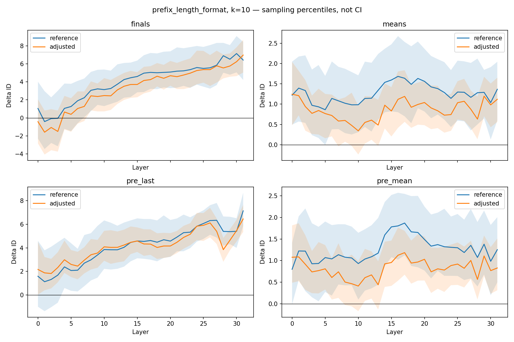
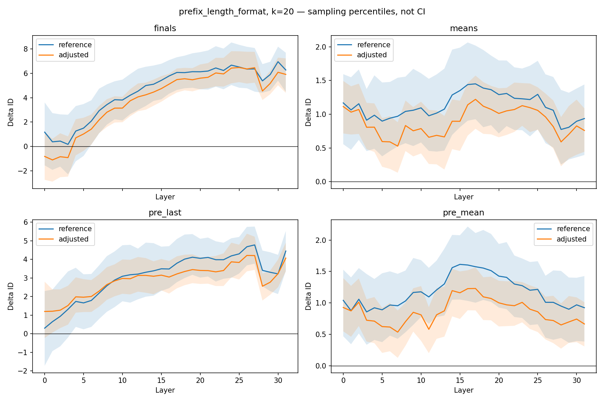

# Length and formatting controls

Experiment tests whether correctness-associated intrinsic-dimension
differences persist after within-problem matching for length and simple
formatting features.

## Configuration

- 120 matched draws
- 80 descriptive permutation draws
- Neighborhood sizes: k=10 and k=20
- L2 normalization
- Leave-one-problem-out sensitivity analysis
- Existing common_clean cohort from the aligned comparison

Each controlled analysis has a reference with the same retained problems
and the same number of attempts per problem.

## Main result

After matching prefix length and formatting, the mean Delta ID across
layers L24–L31 remained positive:

| Representation | k | Reference Delta ID | Controlled Delta ID |
|---|---:|---:|---:|
| pre_mean | 10 | 1.230 | 0.863 |
| pre_mean | 20 | 1.022 | 0.746 |
| pre_last | 10 | 5.985 | 5.460 |
| pre_last | 20 | 4.044 | 3.596 |

This control retained 120 problems and 292 attempts per class.

Positive controlled prefix differences persisted under every
leave-one-problem-out omission at all 32 layers for both k values.

## Interpretation

Estimated difference persists under these specific controls.
Reductions relative to reference are descriptive and do not
establish a causal effect of length or formatting.

Sampling percentiles and LOPO ranges are not confidence intervals.
All late-layer contrast sampling-percentile ranges include zero.

## Figures

