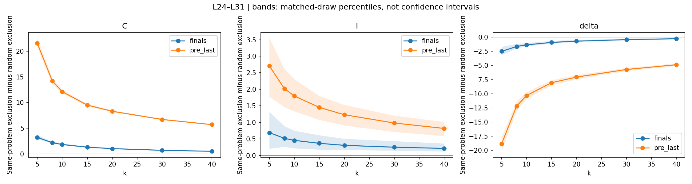

# Same-Problem Neighbor Exclusion

## Research question

Do same-problem neighbors contribute to the lower estimated
intrinsic dimension of correct `pre_last` representations?

Earlier diagnostics showed that correct prefix representations
have more same-problem neighbors at the closest ranks. This
experiment tests their contribution while keeping the original
query points and their weights fixed.

## Experimental design

- Model: Phi-2
- Dataset: GSM8K
- Existing duplicate-filtered cohort: 129 problems
- Matched sampling: 120 draws, each with 397 points per class
- Representations: `pre_last` and `finals`
- Layers: all 32; existing summary window L24–L31
- Neighborhood sizes: k = 5, 8, 10, 15, 20, 30, 40
- Primary neighborhood sizes: k = 10 and k = 20
- Preprocessing: L2 normalization
- Estimator: mean of local Levina–Bickel estimates
- Distances: direct Euclidean computation in float64

All 384 checks reproducing the original k=10/20 results passed.

## Three neighbor-selection conditions

1. **Original:** all other points in the same correctness class
   are eligible neighbors.
2. **Same-problem exclusion:** other attempts from the query's
   problem are excluded from its candidate neighbors.
3. **Random exclusion:** the same number of candidates is removed
   uniformly at random for each query.

Every query point remains in the analysis in every condition.
Twenty random-exclusion repetitions are averaged within each
matched draw. Random schedules are shared across representations,
layers and neighborhood sizes.

## Predictions

Compared with random exclusion, same-problem exclusion should:

- Increase correct `pre_last` ID.
- Increase correct ID more than incorrect ID, reducing Delta ID.

These predictions were stated before running this experiment,
but were motivated by earlier findings on the same dataset.
This is an exploratory follow-up, not independent confirmation.

## Main results

Delta ID = ID(incorrect) - ID(correct).

Values are averaged over layers 24–31 and 120 matched draws.

| Representation | k | Original Delta ID | Random exclusion | Same-problem exclusion |
|---|---:|---:|---:|---:|
| pre_last | 10 | 7.510 | 7.479 | -2.838 |
| pre_last | 20 | 5.610 | 5.575 | -1.486 |
| finals | 10 | 6.834 | 6.836 | 5.477 |
| finals | 20 | 6.981 | 6.979 | 6.272 |

Random exclusion leaves the original gaps nearly unchanged.
Same-problem exclusion has a much larger effect, particularly
for `pre_last`.

At k=10, excluding same-problem neighbors rather than random
candidates increases correct `pre_last` ID by 12.112 and
incorrect ID by 1.796. The gap consequently decreases by 10.317.

At both primary k values, the predicted positive correct-class
effect and negative gap effect occur in every matched draw at
each layer from L24 through L31. These draws reuse attempts
and are not independent replications.

## Supporting distance diagnostics

For queries with at least one other same-problem candidate:

| pre_last class | Mean nearest same-problem distance | Mean nearest different-problem distance |
|---|---:|---:|
| Correct | 0.439 | 0.747 |
| Incorrect | 0.948 | 0.762 |

These averages cover layers 24–31 and matched draws.
The candidate pools differ in size, so this comparison is descriptive.

## Interpretation

On this retained cohort, the positive pooled `pre_last` ID gap
depends strongly on allowing same-problem neighbors.

Excluding those neighbors reverses the late-layer average gap,
while count-matched random exclusion leaves it nearly unchanged.
The `finals` gap decreases but remains positive.

This supports a contribution of within-problem neighborhood
structure to the measured prefix gap. It qualifies earlier
interpretations of that gap as a correctness-related geometric
difference independent of problem grouping.

## Limitations

- Restricted-neighbor estimates describe conditional neighborhoods;
  they do not automatically estimate the same unconditional
  manifold dimension as the original calculation.
- This changes the measurement procedure, not the language model.
- The result does not establish a causal reasoning mechanism.
- The source cohort and hypothesis were developed using these data.
- Matched-draw percentile ranges are not confidence intervals.
- Random repetitions measure computational variability, not
  additional independent observations.
- Prefixes may contain earlier answer mentions.
- We have not established why correct same-problem attempts
  form particularly close neighborhoods.

## Next question

Do shared wording, calculation steps, or answer-related content
explain the close neighborhoods among correct prefix attempts?

## Code

[Notebook 18](../../notebooks/18_same_problem_neighbor_exclusion_phi2.ipynb)
