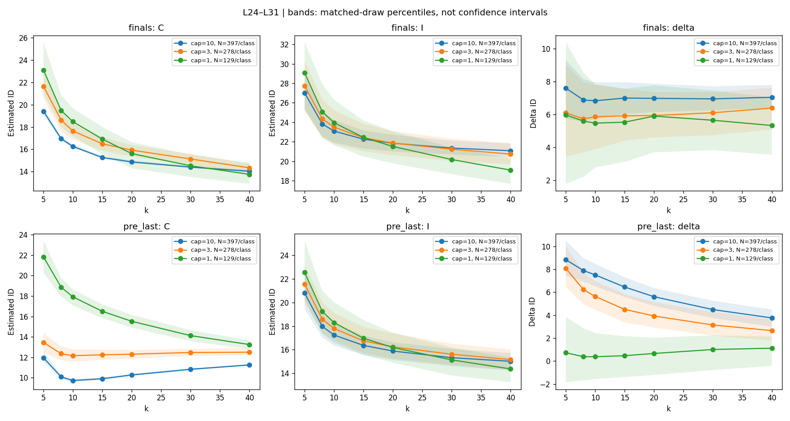

# Neighborhood-Size Diagnostics

## Research question

Why does increasing neighborhood size reduce the correctness-related
intrinsic-dimension gap for `pre_last`, while the late-layer average
gap for `finals` remains approximately stable?

This exploratory analysis follows the existing aligned comparison.

## Experimental setup

- Model: Phi-2
- Dataset: GSM8K
- Representations: `finals` and `pre_last`
- Cohort: 129 problems from the existing duplicate-filtered cohort
- Matched sampling: 120 draws
- Neighborhood sizes: k = 5, 8, 10, 15, 20, 30, 40
- Layers: all 32, with the existing L24–L31 summary window
- Preprocessing: L2 normalization
- Estimator: mean of local Levina–Bickel estimates
- Computation: float64 direct Euclidean distances

The original k=10 and k=20 results were reproduced before extending
the analysis. All 384 reproduction checks passed.

The measured quantity is:

Delta ID = ID(incorrect) - ID(correct)

## Main results

Values below are averaged over layers 24–31 and matched draws.

| Representation | Sampling cap | Points per class | Delta ID, k=10 | Delta ID, k=20 |
|---|---:|---:|---:|---:|
| finals | 10 | 397 | 6.834 | 6.981 |
| finals | 3 | 278 | 5.860 | 5.937 |
| finals | 1 | 129 | 5.473 | 5.901 |
| pre_last | 10 | 397 | 7.510 | 5.610 |
| pre_last | 3 | 278 | 5.631 | 3.930 |
| pre_last | 1 | 129 | 0.378 | 0.660 |

The cap is the maximum number of selected attempts per class
per problem. Every setting retains all 129 problems.

The `pre_last` gap decreases as k increases in the original sample.
Its gap also becomes much smaller when each problem contributes
only one attempt per class.

The `finals` gap remains substantial under all three caps.
Its approximate stability across k applies to the late-layer
average; individual layers show variation.

## Neighbor composition

Under cap=10, same-problem neighbor fractions differ between
representations and correctness classes.

| Representation | Class | Ranks 1–10 | Ranks 11–20 |
|---|---|---:|---:|
| finals | Correct | 6.37% | 1.56% |
| finals | Incorrect | 2.61% | 1.62% |
| pre_last | Correct | 21.39% | 1.13% |
| pre_last | Incorrect | 5.19% | 1.77% |

These percentages are averaged over query points, matched draws,
and layers 24–31. Neighbors are calculated within each
correctness class.

## Interpretation

The results suggest that within-problem neighborhood structure
may contribute to the lower estimated ID of correct prefix
representations.

A possible explanation is that similar attempts at the same
problem form tight groups. Very close neighbors relative to
the outer neighborhood radius can lower the local ID estimate.

This is a hypothesis, not an established causal explanation.
Neighbor identity alone does not determine ID: relative distances
also matter.

## Limitations

- Changing the cap changes sample size, within-problem multiplicity,
  and problem weighting simultaneously.
- The small cap=1 prefix gap does not establish that the underlying
  difference is exactly zero.
- Sampling percentile ranges are not confidence intervals.
- Local estimates can be sensitive to their distribution's tails.
- The cohort and hypotheses were developed using these data.
- Prefixes may contain earlier mentions of the answer.
- These diagnostics do not identify a causal reasoning mechanism.

## Next experiment

Keep the original query points and their weights fixed, then
exclude same-problem points from their candidate neighbors.

Compare this with matched random exclusion to investigate whether
removing same-problem neighbors has a distinctive effect.

## Code

[Colab notebook](../../notebooks/17_neighborhood_size_diagnostic_phi2.ipynb)
