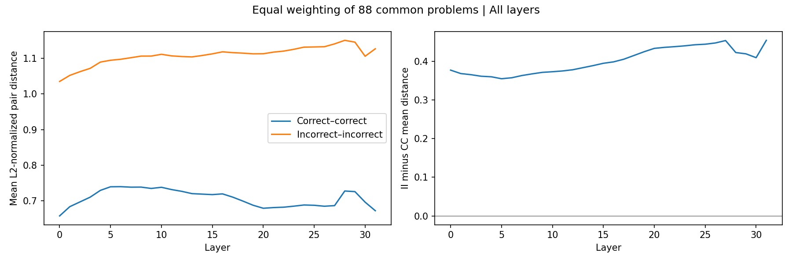
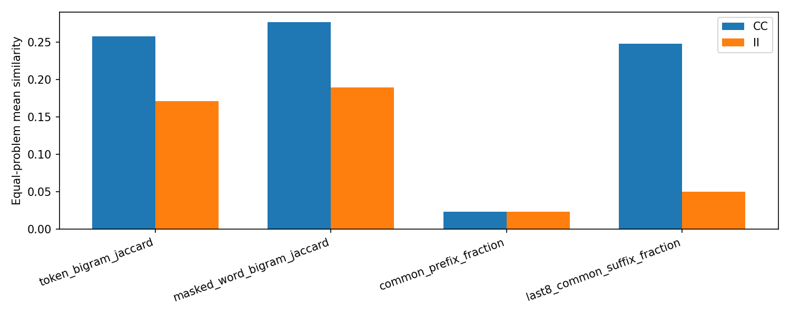
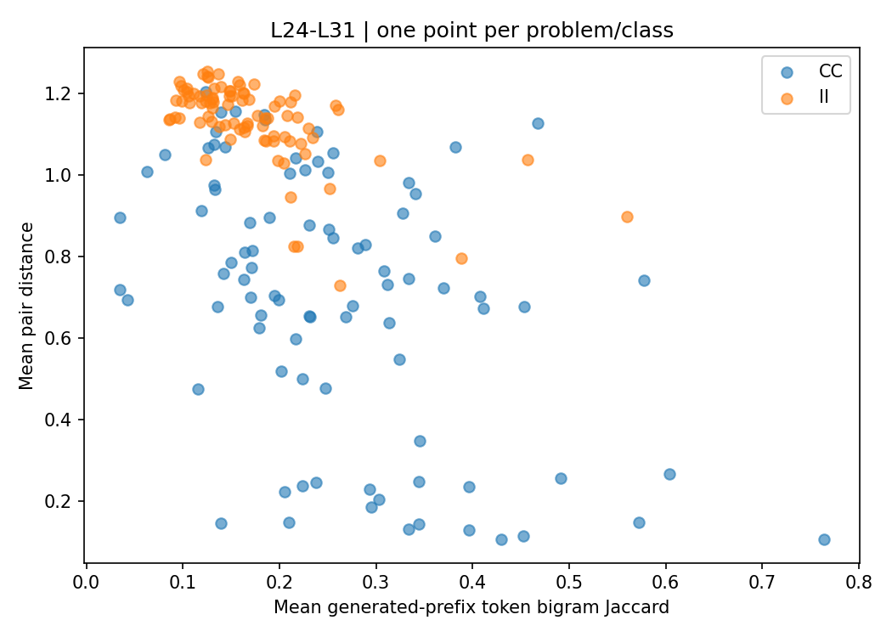

# Prefix text similarity and representation distance

**Notebook 19 · Phi-2 · GSM8K · FINAL run**

Correct attempts at the same problem have closer `pre_last` representations and more similar generated-prefix text than incorrect attempts, on the retained cohort. Similarity near the end of the prefix is associated with smaller representation distances. This analysis is descriptive and does not establish a causal explanation.

## Research question

Why are correct attempts from the same problem particularly close in `pre_last`? One possible contributor is shared wording, especially near the representation's endpoint. This notebook measures text similarity alongside hidden-state distance to investigate that possibility.

## Design

- Start from the previously audited cohort of 2,541 attempts.
- Retain 88 problems with at least two correct and two incorrect attempts.
- Use all unordered within-problem, within-class pairs: 1,056 correct–correct (CC) and 10,084 incorrect–incorrect (II).
- Measure Euclidean distance between row-L2-normalized `pre_last` vectors at all 32 layers, using float64 computation.
- Average pair distances within each problem/class, then give every problem equal weight.
- Keep L24–L31 as the fixed late-layer summary window.

`pre_last` is the hidden state immediately before the token overlapping the selected numeric answer span. Its context includes the prompt. Text-similarity features use only the generated prefix, excluding the shared prompt. Prefixes can contain earlier numeric values and answer mentions.

This notebook measures **pair distances**, not intrinsic dimension or classifier performance. No matching on text features is applied here.

## Representation distances

| Window | Correct–correct | Incorrect–incorrect | II minus CC |
|---|---:|---:|---:|
| L31 | 0.6726 | 1.1264 | 0.4538 |
| L24–L31 | 0.6964 | 1.1328 | 0.4363 |

The mean gap is positive at all 32 layers. Correct pairs are closer in 83 of the 88 problems when using each problem's L24–L31 average. Smaller pair distances do not by themselves imply lower intrinsic dimension.

[Distance summary](tables/geometry_summary.csv) · [Per-problem distances](tables/geometry_by_problem.csv)

## Text similarity

Each score is averaged within problem/class, then equally across the 88 problems.

| Feature | Correct–correct | Incorrect–incorrect |
|---|---:|---:|
| Token-bigram Jaccard | 0.2580 | 0.1711 |
| Number-masked word-bigram Jaccard | 0.2769 | 0.1897 |
| Common-prefix fraction | 0.0231 | 0.0234 |
| Last-eight-token common-suffix fraction | 0.2484 | 0.0499 |
| Last-token equality | 0.5597 | 0.1807 |

- **Token-bigram Jaccard:** intersection divided by union of distinct adjacent-token-pair sets.
- **Number-masked word-bigram Jaccard:** wording overlap after replacing numeric spans with a shared placeholder.
- **Common-prefix fraction:** consecutive matching tokens from the beginning, divided by the shorter generated-prefix length.
- **Common-suffix fraction:** consecutive matching tokens from the end, capped at eight, divided by the shorter available window (up to eight tokens).
- **Last-token equality:** whether the two generated prefixes end on the same token ID.

Correct pairs have more similar endings and greater bigram overlap, including after number masking. Initial consecutive-token agreement is similarly low in both classes. Similarity scores are not percentages of identical sentences, and the four plotted features have different definitions.

[Text similarity summary](tables/text_similarity_summary.csv)

## Association between text similarity and vector distance

The scatter plot below shows one point per problem/class at L31. Its x-coordinate is the problem/class mean token-bigram similarity; its y-coordinate is the mean representation distance. It is not a two-dimensional projection of hidden-state vectors and is not a matched control.

Separately, Spearman correlations are calculated among pairs within each problem/class, requiring at least five pairs and variation in both quantities. CC and II summaries use the same eligible problems for each feature/window. For L24–L31, each pair's distance is first averaged over those layers; the correlation is then calculated.

| Feature | Eligible common problems | Mean CC rho | Mean II rho |
|---|---:|---:|---:|
| Token-bigram Jaccard | 43 | −0.3567 | −0.1448 |
| Number-masked word-bigram Jaccard | 43 | −0.3431 | −0.1498 |
| Common-prefix fraction | 40 | −0.1454 | −0.0427 |
| Common-suffix fraction | 39 | −0.7050 | −0.4357 |

Negative correlations mean greater text similarity tends to accompany smaller vector distances within a problem/class. The suffix result motivates a follow-up endpoint/suffix control. These correlations do not isolate independent contributions of the features, and feature summaries use different eligible subsets.

[Correlation summary](tables/correlation_summary.csv) · [Per-problem correlations](tables/correlations_by_problem.csv)

## Interpretation and limitations

The results support an association between prefix text similarity and within-problem representation closeness. They do not determine whether the contrast reflects shared reasoning, surface wording, intermediate calculations, or other contextual information.

- The cohort inherits duplicate filtering and answer-span selection from earlier analyses.
- Pairs share attempts and are not independent observations. No independent-pair confidence intervals or significance tests are reported.
- Equal problem weighting prevents problems with more pairs from dominating the mean; it does not remove dependence between pairs.
- These follow-up hypotheses were developed using the same dataset.
- Full-prefix content, length, and numeric mentions can differ between classes. This notebook does not adjust for them.
- Float64 distance computation cannot restore precision lost in the stored representations.
- Results concern one model, dataset, and retained cohort.

The next analysis asks whether correct pairs remain closer after balancing endpoint token identities and measured suffix overlap within problems. Those controls are evaluated separately in Notebook 20.

## Code and reproducibility

[Notebook 19](../../notebooks/19_prefix_text_similarity_phi2.ipynb)

The reported results come from the FINAL run, covering all 32 layers. The notebook also has a QUICK mode that evaluates only selected layers; QUICK figures should not replace the FINAL figures on this page.

The notebook requires the original representation cache, frozen attempt metadata, and source cohort/token-audit files. These inputs and the per-layer distance checkpoints are not included in this results folder. Uploading the notebook to Colab alone is therefore insufficient to reproduce the analysis. Reproduction from a fresh environment has not yet been verified.

[Run manifest](manifest.json) · [Retention table](tables/retention.csv)
